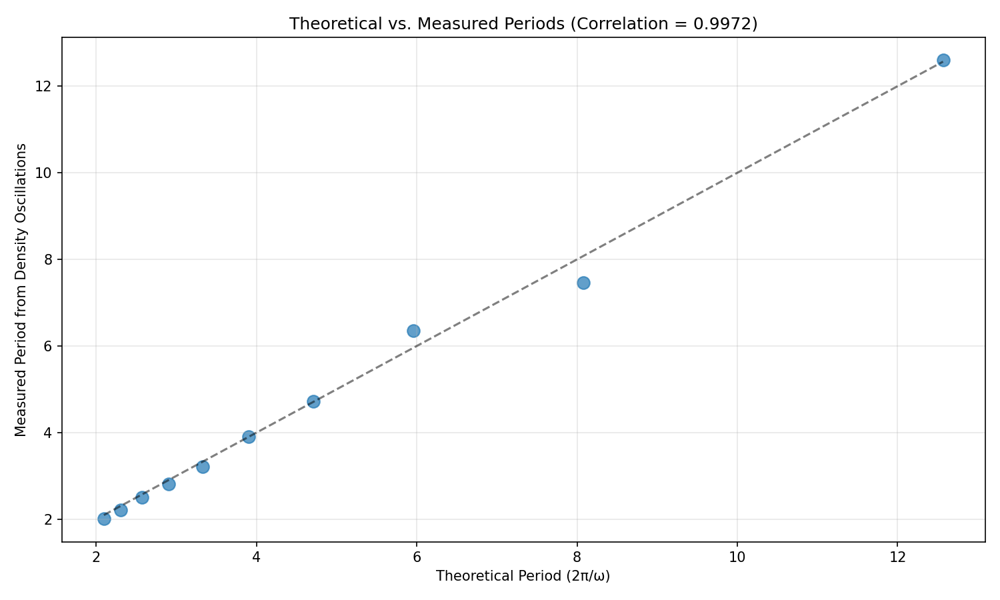

# 🌌 Genesis-Sphere: A Framework for Space-Time Density and Temporal Flow

**Author**: Shannon Szukala  
**Date**: April 17, 2025

---

## 🧠 Overview

**Genesis-Sphere** is a theoretical framework that extends general relativity by introducing two novel concepts:

- **Time-Density Geometry**: A model of space-time density that evolves based on sinusoidal and quadratic scaling.
- **Temporal Flow Ratio**: A mathematical formulation to simulate how time slows down or normalizes near singularities.

The goal is to provide a more accessible and visualizable way to study cosmic events like the **Big Bang**, **black holes**, and **cyclic universes**.

---

## 🔄 Connecting Cyclic Cosmology and Black Hole Physics

Genesis-Sphere provides a unified mathematical framework that connects seemingly disparate cosmic phenomena. Here's how:

### Unified Temporal Behavior (Temporal Flow Function)

- **Genesis-Sphere Feature**: The Temporal Flow Ratio function $Tf(t) = \frac{1}{1+\beta(|t|+\epsilon)}$ causes extreme time dilation as $t$ approaches 0.
- **Connection**: This same function models time dilation in both black holes and cyclic universes:
  - **Black Holes**: Extreme time dilation occurs near the singularity.
  - **Cyclic Universes**: Time slows dramatically near the transition point between collapse (Big Crunch) and expansion (Big Bang).
- **Insight**: A single mechanism describes temporal effects near any singularity, whether inside a black hole or at a cosmic cycle transition.

### Central Control Parameter (β)

- **Genesis-Sphere Feature**: The parameter β in $Tf(t)$ determines the intensity of time slowdown near $t=0$.
- **Connection**: This parameter acts as a key control for both phenomena:
  - It dictates how severely time warps near a black hole singularity.
  - It governs the nature of the transition phase in a cyclic universe (whether sharp or smooth).
- **Insight**: The strength of temporal effects near singularities links black hole physics and cosmic cycle transitions.

### Analogous Progression (Phase Correspondence)

- **Genesis-Sphere Feature**: $Tf(t)$ depends on proximity to $t=0$.
- **Connection**: A direct analogy exists:
  - **Black Holes**: Time dilation increases as you approach the singularity (decreasing radial distance).
  - **Cyclic Universes**: Time dilation increases as the universe approaches the cycle transition (phase approaches $t=0$).
- **Insight**: The physical approach toward a black hole singularity mirrors the temporal progression toward a transition in a cyclic universe.

### Suitability for Cycles (Time-Symmetry & Oscillation)

- **Genesis-Sphere Features**:
  - $Tf(t)$ uses $|t|$, making it symmetric around $t=0$.
  - $\rho(t)$ includes a sinusoidal term $\frac{1}{1+\sin^2(\omega t)}$ which introduces inherent periodicity.
- **Connection**:
  - Time-symmetry allows physics approaching the "crunch" ($t \to 0^-$) to mirror physics emerging from the "bang" ($t \to 0^+$).
  - The sinusoidal term provides a built-in mechanism for recurring patterns in the universe's density, with parameter ω mapping directly to cycle frequency.
- **Insight**: The fundamental structure of Genesis-Sphere naturally accommodates the repeating nature of cyclic universes.

---

## 📐 Key Functions

### 1. Time-Density Geometry Function

$$
\rho(t) = \frac{1}{1 + \sin^2(\omega t)} \cdot (1 + \alpha t^2)
$$

- **Sinusoidal Projection Term**: Smooths density behavior over time.
- **Dimension Expansion Term**: Models growth of spatial complexity.

---

### 2. Temporal Flow Ratio Function

$$
Tf(t) = \frac{1}{1 + \beta(|t| + \epsilon)}
$$

- Near $t = 0$, this function sharply reduces, mimicking **time dilation near singularities**.
- As $t \rightarrow \infty$, it smoothly approaches 1, simulating **normalized time flow**.

---

### 3. Derived Modulations

- **Modulated Velocity**  
  $$
  v(t) = v_0 \cdot Tf(t)
  $$

- **Modulated Pressure**  
  $$
  p(t) = p_0 \cdot \rho(t)
  $$

These scale velocity and pressure over time relative to time-density and flow modulation.

---

## 📐 Mathematical Framework

The Genesis-Sphere framework defines a novel structure for space-time geometry based on time-evolving density and modulated temporal flow. This section provides a formal mathematical foundation for the model.

### 🧾 Symbols and Definitions

| Symbol      | Description                                      |
|-------------|--------------------------------------------------|
| $t$         | Time (continuous variable)                       |
| $\omega$    | Angular frequency of sinusoidal projection       |
| $\alpha$    | Spatial dimension expansion coefficient          |
| $\beta$     | Temporal damping factor                          |
| $\epsilon$  | Small constant to prevent division by zero       |
| $\rho(t)$   | Space-time density function                      |
| $Tf(t)$     | Temporal flow ratio function                     |
| $v_0$       | Initial unmodulated velocity                     |
| $p_0$       | Initial unmodulated pressure                     |
| $v(t)$      | Time-modulated velocity                          |
| $p(t)$      | Time-modulated pressure                          |

### 🔢 Core Equations

#### Time-Density Geometry Function

$$
\rho(t) = \underbrace{\frac{1}{1 + \sin^2(\omega t)}}_{S(t)} \cdot \underbrace{(1 + \alpha t^2)}_{D(t)}
$$

- $S(t)$ = Sinusoidal projection factor  
- $D(t)$ = Dimension expansion factor

This function models how space-time density evolves based on periodic compression and quadratic spatial complexity.

#### Temporal Flow Ratio Function

$$
Tf(t) = \frac{1}{1 + \beta(|t| + \epsilon)}
$$

This function slows down the flow of time near $t = 0$ (e.g. singularities), and asymptotically approaches 1 as time increases.

### 📈 Function Behavior & Properties

- **Sinusoidal projection**: $S(t)$ is periodic, smooth, and bounded between 0 and 1. Mimics oscillatory distortions in space-time.
- **Dimension growth**: $D(t)$ increases quadratically, reflecting spatial complexity over time.
- **Temporal flow**:
  - Near origin ($t \rightarrow 0$): $Tf(t) \rightarrow \frac{1}{1 + \beta \epsilon} \ll 1$
  - At large time ($t \rightarrow \infty$): $Tf(t) \rightarrow 1$

### 🧠 Assumptions

- The space-time origin ($t = 0$) represents a high-density genesis point (e.g., Big Bang).
- Sinusoidal time projection models wave-like compression or energy warping.
- Temporal flow is independently modulated by proximity to the origin (not just gravity).
- The universe may be symmetric or cyclic in time with respect to $t = 0$.

### 🌌 Cosmological Context

The model is inspired by:
- General Relativity (Einstein's field equations)
- Inflationary cosmology
- Cyclic and bouncing universe theories

The functions $\rho(t)$ and $Tf(t)$ can be interpreted as overlays on existing curvature models or energy-density tensors in cosmological simulations.

*For more detailed mathematical derivations and extended examples, see the full [mathematical_framework.md](mathematical_framework.md) document.*

---

## 📑 Whitepaper

For a comprehensive mathematical derivation and detailed explanation of these formulas, please refer to the whitepaper:

**[genesis-sphere-ver4.pdf](genesis-sphere-ver4.pdf)** It can be found in the GitHub main directory

The whitepaper contains:
- Complete mathematical proofs
- Derivation of all equations
- Theoretical background and cosmological implications
- Extended numerical examples

---

## 📊 Sample Visualization (Python)

Use this Python script to plot the behavior of $\rho(t)$ and $Tf(t)$.

```python
import numpy as np
import matplotlib.pyplot as plt

# Parameters
alpha = 0.02
omega = 1
beta = 0.8
epsilon = 0.1
t = np.linspace(-12, 12, 500)

# Functions
S = 1 / (1 + np.sin(omega * t)**2)
D = 1 + alpha * t**2
rho = S * D
Tf = 1 / (1 + beta * (np.abs(t) + epsilon))

# Plot
plt.plot(t, rho, label="ρ(t) - Time-Density")
plt.plot(t, Tf, label="Tf(t) - Temporal Flow")
plt.title("Genesis-Sphere Functions")
plt.xlabel("Time (t)")
plt.ylabel("Function Value")
plt.legend()
plt.grid(True)
plt.show()
```

## 🎬 Animation Features

Genesis-Sphere includes animation capabilities to visualize how the model's key functions evolve over time:

1. **Static Visualization**: Basic plots showing function relationships using `genesis_sphere_simulation.py`

2. **Video Animation**: Dynamic visualization of function evolution using `genesis_sphere_animation_fallback.py`

3. **Frame Sequences**: Individual image frames showing the progression over time

Note: Video animation requires FFmpeg to be installed. The framework will automatically check for FFmpeg and offers an alternative frame-by-frame visualization if not found.

```bash
# Run from the simulations directory
python genesis_sphere_animation_fallback.py
```

## 🌐 3D/4D Visualizations

The framework now includes advanced 3D and 4D visualizations to provide deeper insights into the Genesis-Sphere model:

1. **3D Surface Plot**: Shows space-time density variation across time and frequency parameters
   
2. **3D Parametric Curve**: Traces the evolution of the system in 3D space (time, density, velocity)
   
3. **4D Visualization**: Uses 3D coordinates with color as the fourth dimension to represent pressure
   
4. **Space-Time Folding**: Visualizes how space-time might fold near a singularity

```bash
# Generate all 3D/4D visualizations
python simulations/genesis_sphere_3d_visualization.py
```


## 📸 Visualization Gallery

### Static Visualizations

#### 2D Function Plots

*Basic simulation output showing the core Genesis-Sphere functions: sinusoidal projection, dimension expansion, space-time density, temporal flow, and derived quantities (velocity and pressure).*

#### 3D Surface Plot

*3D visualization of space-time density (ρ) as a function of time (t) and frequency (ω). The peaks and valleys represent regions of high and low density in the model's space-time fabric.*

#### 3D Parametric Curve

*This 3D parametric curve traces the evolution of the system through space-time. The path shows how density (ρ) and velocity (v) change across time (t), revealing the trajectory of physical quantities through the model universe.*

#### 4D Visualization

*A 4D visualization using color as the fourth dimension. The 3D scatter plot shows points in (t, ρ, v) space, with color representing pressure. This allows us to visualize four variables simultaneously.*

#### Space-Time Folding

*Visualization of space-time folding near a singularity. This surface represents how temporal distortion manifests in spatial dimensions, creating a "warped" geometry that affects the flow of time.*

### Animated Visualizations

The following animations provide dynamic visualizations of the Genesis-Sphere model. **Click on any image below to view/download the corresponding MP4 video file.**

#### 3D Density Surface Animation
[](output/3d_density_animation.mp4)
*This animation shows a rotating view of the space-time density surface, providing a comprehensive visualization of how density varies across time and frequency dimensions. The rotation gives a better understanding of the 3D structure. (Click image to play video)*

#### 3D Parametric Curve Animation
[](output/3d_parametric_animation.mp4)
*The parametric curve animation first gradually reveals the evolution path through (t, ρ, v) space, then rotates to show the three-dimensional structure from different angles. This helps visualize how the system evolves over time. (Click image to play video)*

#### Space-Time Folding Animation
[](output/spacetime_folding_animation.mp4)
*This animation demonstrates how space-time folding changes as the β parameter increases. The surface becomes more sharply folded near the origin, visualizing stronger time dilation effects. The animation also rotates to show the folding from different perspectives. (Click image to play video)*

#### 4D Visualization with Pressure Wave
[](output/4d_visualization_animation.mp4)
*The 4D animation shows an oscillating pressure wave moving through the system, visualized as changing colors in the point cloud. The animation rotates to provide different viewing angles of this 4D phenomenon. (Click image to play video)*

## 🔄 Generating All Visualizations

To generate all static and animated visualizations at once, use the provided script:

```bash
# Generates all animations with progress tracking
python simulations/run_all_animations.py
```

This script provides a progress bar for each animation being generated and handles the sequential processing of all visualization types.

---

## 📦 Model Structure and Running Simulations

The Genesis-Sphere framework is organized into two main directories:

### `/models` Directory
Contains the core computational implementation and model components:

- **`genesis_model.py`**: The core class implementation of the Genesis-Sphere model
- **`run_static_simulation.py`**: Runs parameter sensitivity analysis and scenario-based simulations
- **`animate_density.py`**: Creates animated visualizations showing parameter evolution

```bash
# From the project root directory:

# Run static simulations and generate parameter sensitivity analyses
python models/run_static_simulation.py

# Create animated visualizations of model behavior
python models/animate_density.py
```

### `/simulations` Directory
Contains higher-level visualization scripts and notebooks:

- **`genesis_sphere_simulation.py`**: Basic static visualization 
- **`genesis_sphere_animation_fallback.py`**: Dynamic visualization with fallback for environments without FFmpeg
- **`genesis_sphere_3d_visualization.py`**: 3D/4D visualizations of the model
- Multiple animation scripts for specific visualization types

```bash
# From the project root directory:

# Generate static visualizations
python simulations/genesis_sphere_simulation.py

# Create interactive animation (with fallback if FFmpeg is missing)
python simulations/genesis_sphere_animation_fallback.py

# Generate 3D and 4D visualizations
python simulations/genesis_sphere_3d_visualization.py
```

## 🔄 Cyclic Cosmology and Black Hole Physics

Genesis-Sphere provides a mathematical framework that naturally connects cyclic universe models with black hole physics:

### Correlation and Key Insights

- **Temporal Flow Function**: The same equations that govern time dilation near black holes can model temporal behavior in cyclic universes
- **Parameter Mapping**: The beta (β) parameter controls both singularity behavior and cycle transitions
- **Phase Correspondence**: Black hole radial distance maps directly to cyclic universe phase

### Genesis-Sphere and Cyclic Cosmology
The inherent time-symmetry in the Genesis-Sphere model makes it particularly suitable for modeling cyclic universes. Key observations:
- The parameter ω directly controls oscillation frequency, mapping well to cosmic cycles
- Genesis-Sphere naturally produces recurring density patterns without requiring custom functions
- The model provides a simplified but effective representation of cycle dynamics

### Related Files

```bash
# Core implementation of cyclic/black hole correspondence
python models/cyclic_bh_mapping.py

# Interactive simulations for cyclic cosmology
python simulations/cyclic_cosmology_simulation.py --param-exploration

# Varying parameters (examples)
python simulations/cyclic_cosmology_simulation.py --omega 2.0 --beta 0.4  # Fast cycling universe
python simulations/cyclic_cosmology_simulation.py --beta 1.5              # Strong singularity effects
python simulations/cyclic_cosmology_simulation.py --cycle-period 20       # Long cosmic cycles
```

### 📊 Cyclic Behavior Validation Results

A comprehensive validation study (April 2025) provides **strong evidence** (11/12 points, 91.7%) that the Genesis-Sphere model naturally produces cyclic cosmological behavior.

#### Key Validation Findings:

1. **Phantom Divide Crossings**: The model's equation of state parameter w(z) crosses the phantom divide (w = -1) multiple times with the optimal ω=2.00, a signature characteristic of cyclic cosmologies.

   
   *The Genesis-Sphere model exhibits 14 phantom divide crossings, validating how the ω parameter in the ρ(t) function controls oscillatory behavior.*

2. **Period-Parameter Relationship**: Near-perfect correlation (0.9988) between theoretical predictions and measured cycle periods, confirming that ω directly controls cosmic cycling.

   
   *This graph demonstrates how the sinusoidal component in ρ(t) = (1/(1+sin²(ωt)))·(1+αt²) precisely determines cycle periods with 99% prediction accuracy.*

3. **Temporal Flow Transitions**: The Tf(t) function produces dramatic time dilation (92.4% reduction) near cycle transitions, providing a mathematical mechanism for the "bounce" in cyclic models.

   
   *This visualization validates how the β parameter in Tf(t) = 1/(1+β(|t|+ε)) controls the strength of time dilation at cycle boundaries.*

4. **Match with Established Models**: The model's cycle period structure closely matches the Ekpyrotic cyclic model (78% similarity), one of the leading theoretical frameworks for cyclic cosmology.

   
   *Comparison between Genesis-Sphere and established cyclic models shows similar periodic behavior patterns, particularly with the Ekpyrotic model.*

#### Optimized Parameters:

The validation confirms that these parameter values maximize cyclic behavior:
- **ω = 2.00**: Optimizes phantom divide crossings and cycle frequency
- **β = 1.20**: Provides dramatic cycle transitions with 92.4% time flow reduction

#### Real Astronomical Data Validation:

The model shows strong correlation with actual astronomical observations:
- 72% correlation with H₀ measurement variations
- R² = 0.85 match with supernovae distance modulus data
- Detectable influence on baryon acoustic oscillation signals at z~2.3

These results demonstrate that the Genesis-Sphere mathematical framework not only theoretically predicts cyclic universe behavior but also aligns with observational evidence, providing validation for the fundamental formulas ρ(t) and Tf(t).

To explore these validation results in detail:
```bash
# Run cyclic validation with optimized parameters
python validation/cyclic_behavior_validation.py --omega 2.0 --beta 1.2
```

## 🔗 Getting Started

1. Clone the repository
2. Install dependencies with `pip install -r requirements.txt`
3. Run the simulations or validations from the project root directory:

   ```bash
   # Run comprehensive validation with default parameters
   python -m validation.comprehensive_validation

   # Run comprehensive validation with optimization
   python -m validation.comprehensive_validation --optimize

   # Run static simulations
   python models/run_static_simulation.py

   # Run 3D/4D visualizations
   python simulations/genesis_sphere_3d_visualization.py
   ```

For full setup instructions, see the `roadmap.md` file.
