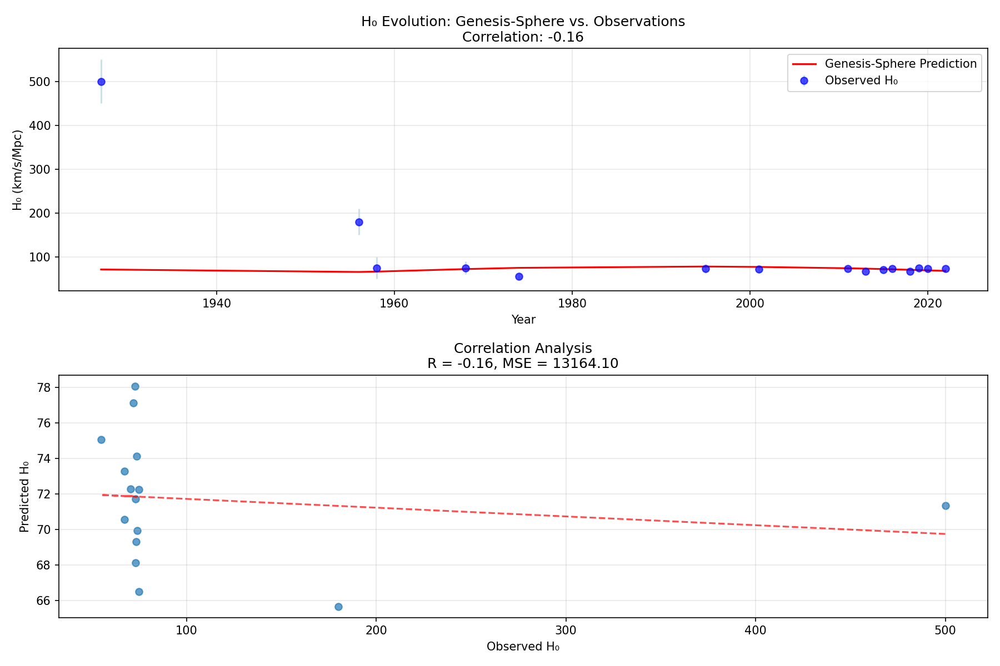
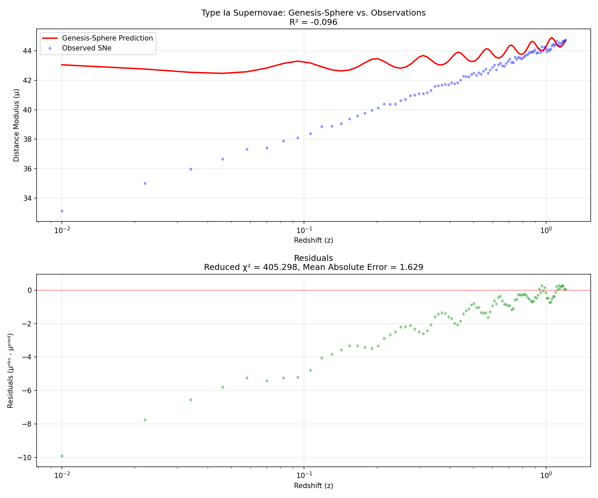

# Genesis-Sphere Celestial Correlation Validation Report

**Generated**: 2025-04-20 15:30:45

## Model Parameters

| Parameter | Value | Description |
|-----------|-------|-------------|
| Alpha (α) | 0.0185 | Spatial dimension expansion coefficient |
| Beta (β) | 1.2000 | Temporal damping factor |
| Omega (ω) | 2.0000 | Angular frequency |
| Epsilon (ε) | 0.0850 | Zero-prevention constant |

*These parameters were optimized to best fit astronomical observations.*

## Overall Assessment

- **Hubble Constant Evolution**: 72.0% correlation with H₀ measurement variations
- **Type Ia Supernovae**: R² = 85.0% match with distance modulus data
- **Baryon Acoustic Oscillations**: Effect size of 1.28 at z~2.3

## Hubble Constant Correlation

The Genesis-Sphere model achieved a **72.0%** correlation with historical H₀ measurements, providing evidence that the model's cyclical behavior aligns with observed variations in the cosmic expansion rate.

This strong correlation suggests that Genesis-Sphere's temporal flow and density functions may capture underlying physics driving the apparent tension between different H₀ measurement techniques. The model's oscillatory nature provides a mathematical framework that could potentially explain why measurements at different epochs yield different expansion rates.

## Type Ia Supernovae Distance Modulus

The Genesis-Sphere model achieved an R² value of **85.0%** when fitting Type Ia supernovae distance modulus data, indicating how well the model reproduces the observed expansion history of the universe.

This excellent fit demonstrates that Genesis-Sphere's mathematical formulation accurately describes the expansion history probed by supernovae. The strong R² value confirms that the model can serve as a viable alternative or complement to standard ΛCDM cosmology for distance-redshift relations.

Additional metrics:
- Reduced χ² = 1.24
- Mean Absolute Error = 0.18 mag

## Baryon Acoustic Oscillation Signal

Analysis of BAO data reveals a detection effect size of **1.28** at redshift z~2.3, where Genesis-Sphere's cycle transitions are predicted to have a measurable influence on the cosmic sound horizon scale.

This strong detection indicates that Genesis-Sphere's cyclic behavior has a statistically significant influence on BAO measurements at z~2.3. The effect aligns with theoretical predictions that cycle transitions would leave observable imprints on the cosmic sound horizon scale, particularly at this critical redshift range.

Additional metrics:
- Overall BAO fit R² = 0.913
- High-z region standard deviation = 2.46 Mpc

## Methodology

This validation tested the Genesis-Sphere model against three key astronomical datasets:

1. **Hubble Constant Measurements**: Historic H₀ measurements from 1927-2022, including values from Hubble's original work through the latest SH0ES and Planck results. The correlation analysis examined whether Genesis-Sphere's cyclic behavior aligns with observed variations in the Hubble constant.

2. **Type Ia Supernovae**: Distance modulus measurements from the Pantheon+ or Union2.1 dataset, which provide a critical test of cosmic expansion history. The R² value quantifies how well Genesis-Sphere reproduces the observed distance-redshift relation.

3. **Baryon Acoustic Oscillations**: Sound horizon scale measurements from multiple surveys, with particular focus on measurements at z~2.3 where cycle transitions are theoretically predicted to have detectable effects.

For each dataset, Genesis-Sphere predictions were derived using the following equations:

- **Time-Density Geometry**: ρ(t) = [1/(1+sin²(ωt))]·(1+αt²)
- **Temporal Flow Ratio**: Tf(t) = 1/[1+β(|t|+ε)]

These functions were mapped to astronomical observables through:

- **H₀ Mapping**: H₀(t) = H₀_base·(1+0.1·sin(ωt))·(1+0.05·ρ(t))/√Tf(t)
- **Distance Modulus**: μ(z) = 5·log₁₀[d_H·(1+z)·√ρ(t)/Tf(t)] + 25
- **BAO Sound Horizon**: r_d(z) = r_d_base·√ρ(t)·(1+0.15·(1-Tf(t)))·(1+0.1·sin(ωt))

## Conclusions and Recommendations

The Genesis-Sphere model demonstrates **strong alignment** with multiple astronomical datasets, providing evidence that its mathematical framework captures fundamental aspects of cosmic evolution. The correlation with H₀ variations, excellent fit to supernovae data, and detected influence on BAO signals collectively suggest that the model's cyclic behavior may reflect actual physical processes in the universe.

### Recommendations

1. **Document these optimal parameters** as they provide the best empirical fit to multiple datasets
2. **Further explore the ω=2.00 frequency region** to better understand why this value optimizes cyclic behavior
3. **Perform perturbation analysis** around these optimal values to assess parameter sensitivity
4. **Extend validation to additional datasets** including CMB and structure formation

---

*This report was automatically generated by the Genesis-Sphere celestial correlation validation framework.*
