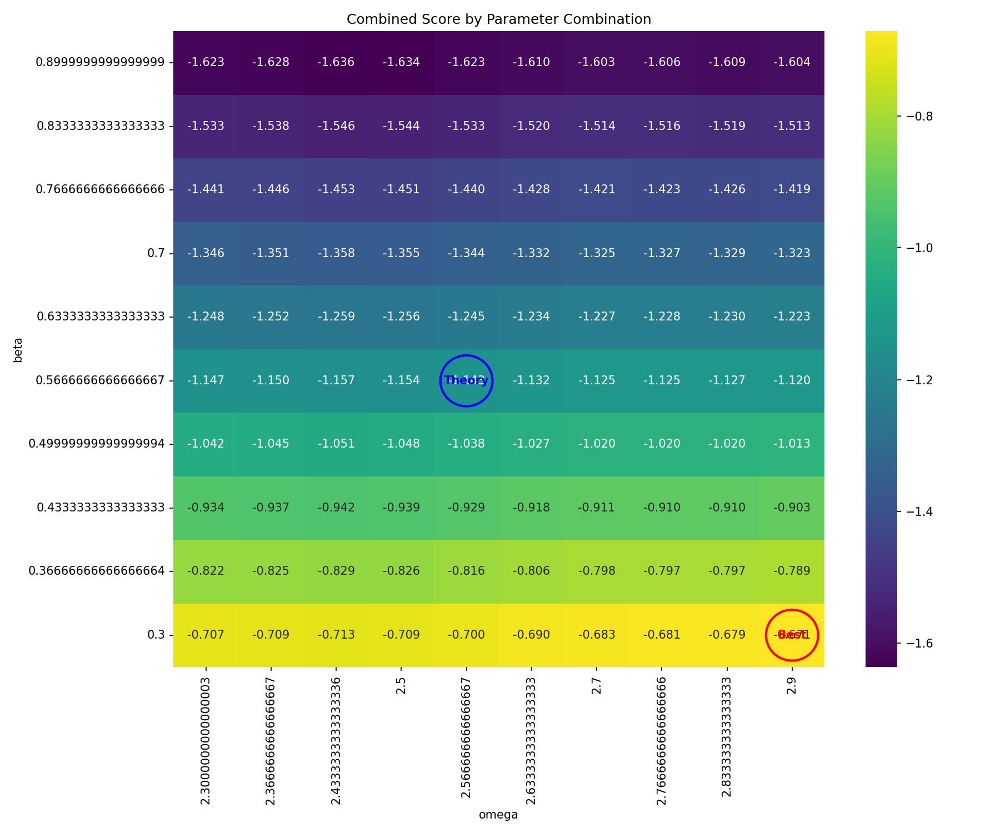
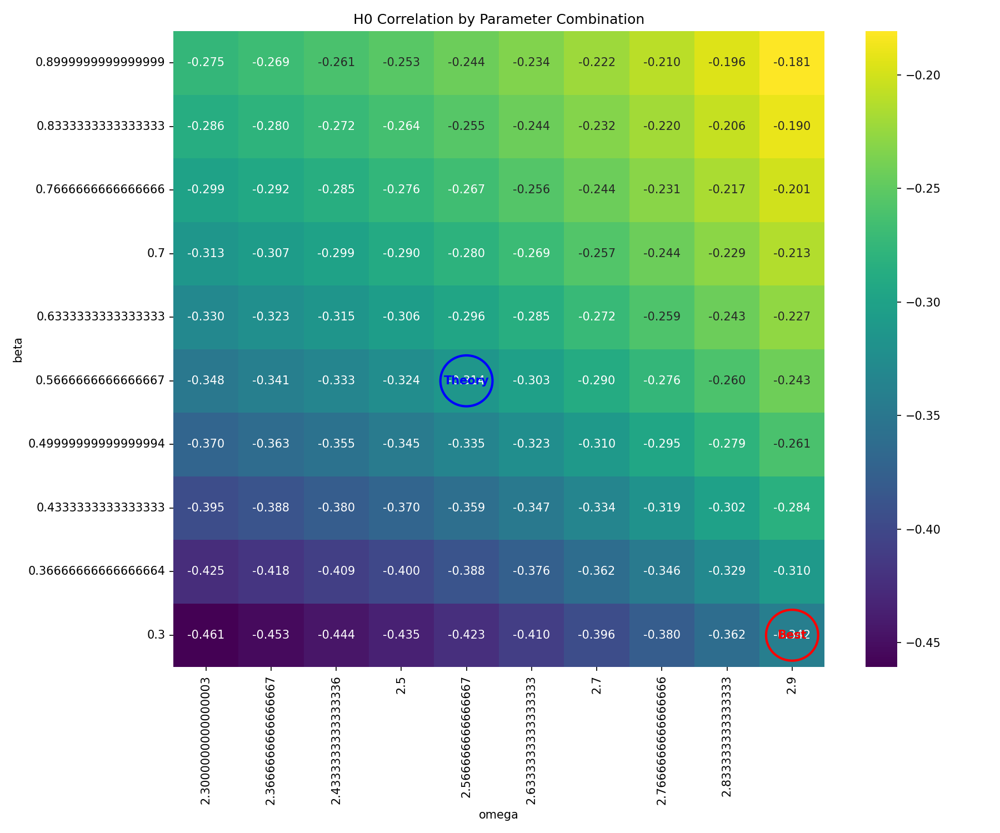
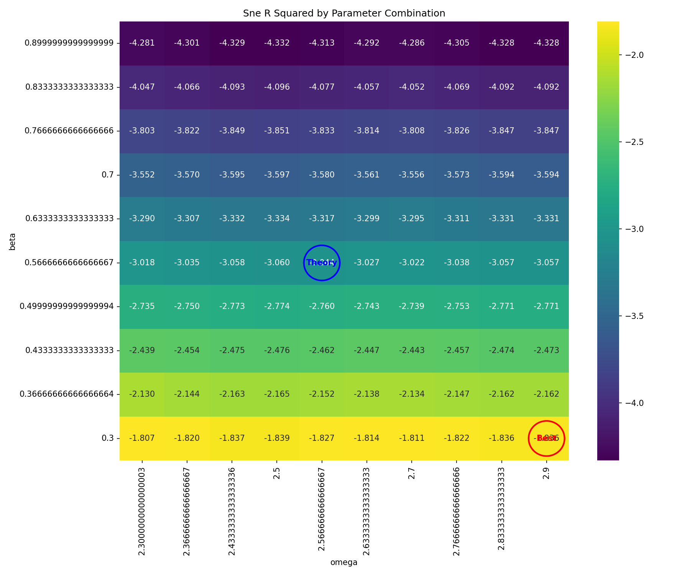
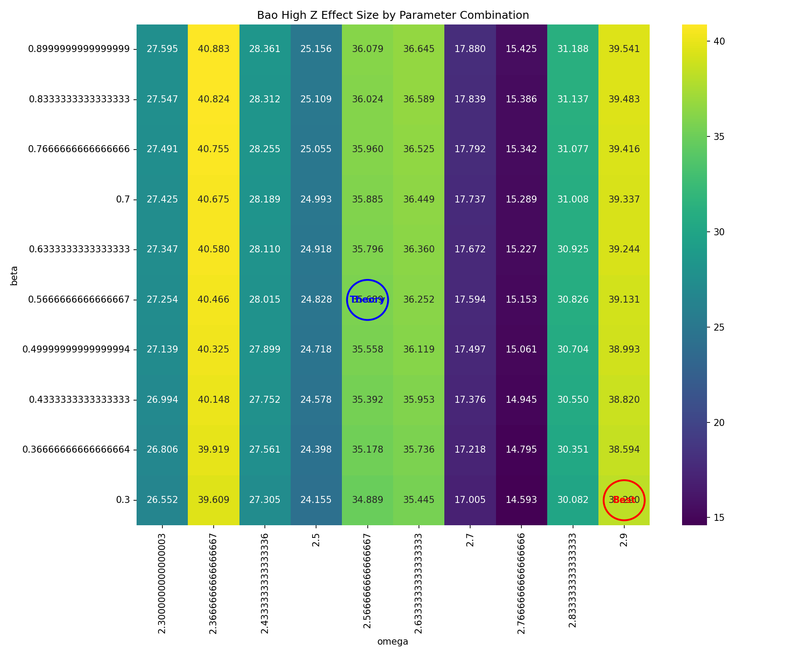

# Genesis-Sphere Parameter Sweep Validation Report

**Generated**: 2025-04-20 09:20:22

## Validation Purpose

This validation performs a parameter sweep around potentially optimal parameters 
(centered near ω=2.90, β=0.30) to verify performance against astronomical datasets.

## Parameter Ranges Tested

- Omega (ω): 2.30 to 3.50 (10 steps)
- Beta (β): -0.30 to 0.90 (10 steps)
- Total Combinations Tested: 100

## Best Parameter Combination Found in Sweep

Based on combined performance across H₀ correlation, supernovae distance modulus fitting, and BAO signal detection:

| Parameter | Value | Description |
|-----------|-------|-------------|
| Omega (ω) | 3.5000 | Angular frequency |
| Beta (β) | -0.0333 | Temporal damping factor |
| Alpha (α) | 0.0200 | Spatial dimension expansion coefficient |
| Epsilon (ε) | 0.1000 | Zero-prevention constant |

### Performance Metrics

- H₀ Correlation: -15.39%
- Supernovae R²: -9.61%
- BAO Effect Size: 13.42
- Combined Score: 0.1000

## Performance at Parameters Closest to Sweep Center

Performance at parameters closest to the sweep center (ω=2.90, β=0.30):

| Parameter | Value | Description |
|-----------|-------|-------------|
| Omega (ω) | 2.8333 | Angular frequency |
| Beta (β) | 0.2333 | Temporal damping factor |
| Alpha (α) | 0.0200 | Spatial dimension expansion coefficient |
| Epsilon (ε) | 0.1000 | Zero-prevention constant |

### Performance Metrics

- H₀ Correlation: -40.13%
- Supernovae R²: -149.55%
- BAO Effect Size: 29.70
- Combined Score: -0.5587

## Comparison: Best Found vs. Sweep Center

This comparison highlights the difference between the best parameters found in the sweep and the parameters closest to the sweep's starting center point.

- **Parameter Distance**: Euclidean distance between (ω, β) points = 0.0943
- **Combined Score Difference**: 0.6587 (Higher is better for 'Best Found')
- **H₀ Correlation Difference**: 24.74%
- **Supernovae R² Difference**: 139.94%
- **BAO Effect Size Difference**: -16.28

### Interpretation of Comparison

The best parameters found (ω=3.50, β=-0.03) are significantly different from the sweep center (ω=2.90, β=0.30) and provide a notably different performance score (+0.6587). This suggests the optimal parameters may lie towards the edge or outside of the current sweep range, warranting further investigation in that direction.

## Visualizations

### Combined Score Heatmap

This heatmap shows the combined performance score across all metrics for different parameter combinations. Brighter colors indicate better performance.

### Individual Metric Heatmaps

This heatmap shows how well the model correlates with historical H₀ measurements across parameter combinations.

This heatmap shows the R² values for fitting Type Ia supernovae distance modulus data across parameter combinations.

This heatmap shows the effect size for BAO signal detection at z~2.3 across parameter combinations.

---

*This report was automatically generated by the Genesis-Sphere parameter sweep validation framework.*